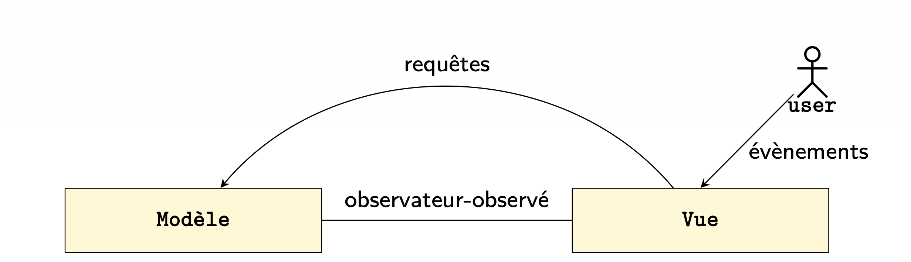

Pattern Observateur / Observé (Observer / Observable en anglais)

Si dans un programme, une méthode x doit être déclenchée à chaque fois qu’une méthode y l’est ou le décide.
Première solution (pas la bonne) l’attente active :
	main interroge y tous les 10ms : « as-tu fait g() ? »
	Si oui, appel de x.f()

Mauvaise solution car :
consomme du CPU
ralentit toute l’application
mauvais couplage : main doit tout savoir
impossible à maintenir surtout si nombreux observateurs et observés

Bonne solution utilisation du paterne Observer :
y signale à x qu’une màj a eu lieu (x.notify())
car x s’est préalablement enregistré auprès y
x.notify() décide comment réagir

Y ne connaît pas ce que X fait mais elle sait que quand quelque chose change chez elle, elle doit le signaler. Bon découplage des choses. Elle sait quelle doit prévenir X car au début du programme X c’est enregistré chez Y.
En résumé chez Y il y a une interface observer qui contient la méthode notify() donc dans le code de Y on aura x.notify() pour prévenir X.

Nouvelles méthodes dans la classe de Y :
y.notifyObservers() (a.k.a. notifyObservers)
y.addObserver(Observer o) (addSubscriber)
y.removeObserver(Observer o) (RemoveSubscriber)

Défaut de ce pattern, il ne faut pas oublier de se désinscrire si on ne l’utilise plus et notify() n‘est pas discriminant, il alerte tout les inscrit même si pas concerné.

